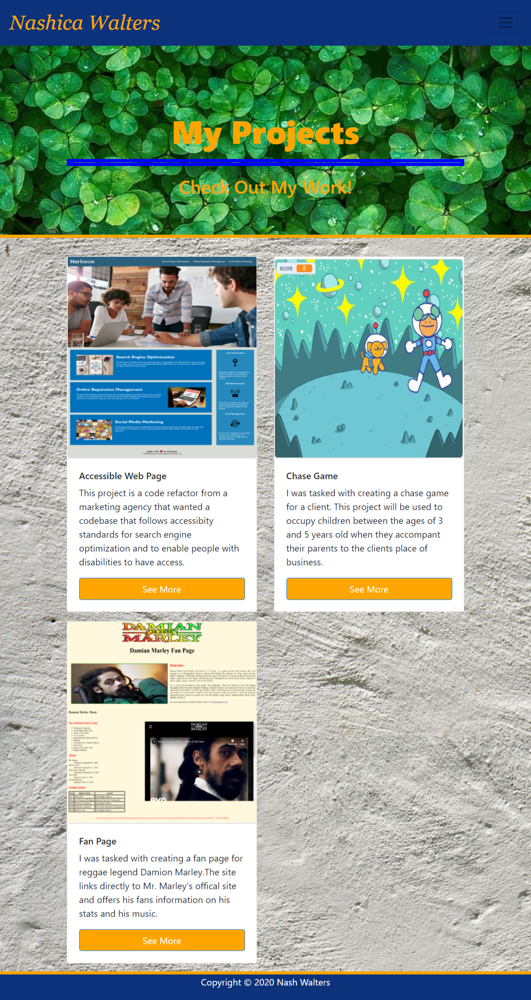
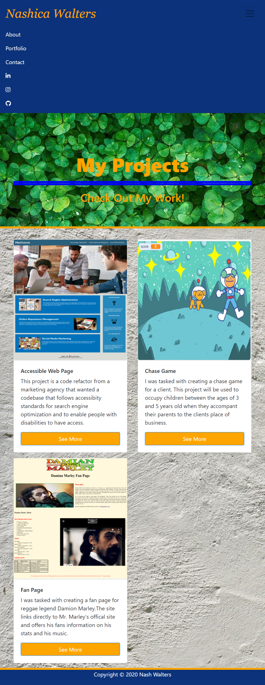
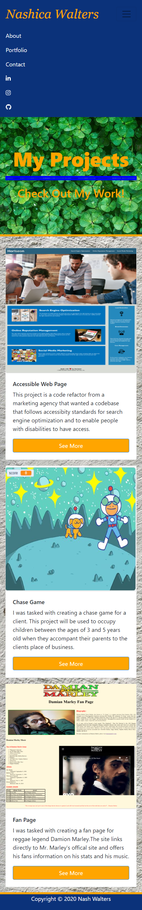

# Portfolio

This project is a responsive designed portfolio using Bootstrap's grid system and components.

## Table of Contents
* [General Information](#general-information)
* [Technology](#technology)
* [Installation](#installation)
* [Screenshots](#screenshots)
* [Credits](#credits)
* [License](#license)

## General Information

It is evident that as technological advances are made, screen sizes seem to get smaller. Now more than ever a lot of people are using mobile devices, especially their cellphones to access information. It is estimated that so far in 2020, mobile devices generated 50.81 percent of global website traffic. As a result, responsive web designs and mobile-first designs play an important role in making information small screen friendly. These designs not only increase traffic to a website from mobile users it also improves SEO efforts and provides a seamless user experience.

## Technology

There are may tools/ frameworks that can be used to make responsive websites. The frame I used is Bootstrap v4.5.3.

  
What is Bootstrap?

  
Bootstrap is an open-source toolkit that is used to make responsive mobile-first sites. It saves you from writing a lot of CSS codes and it is free, which is a great bonus.

Why use Bootstrap?

  
Bootstrap comes with components you can easily tack onto your web page, including: navbars, dropdowns and button. It comes with its own grid system and also allows developers to take advantage of custom JQuery plugins. Bootstrap also comes with its own code for automatically resizing images based on the current screen size. Just add the .img-responsive class to your images, and the predefined CSS rules take care of the rest.
  

 
How to use Bootstrap?

  
 You can downnload Bootstrap from the website. You can also include Bootstrap from a CDN and placing the link in the head tag of your HTML. The JQuery plugins are added to the body tag. Don't just take my word for it, visit <a href= "https://getbootstrap.com/">Bootstrap.com</a> to see for yourself and to get started.
  

I also used the HTML Validation Serice [W#C Validation Markup Service](https://validator.w3.org/#validate_by_upload+with_options)

## Installation

A web browser is need to view page.

* Github page: 

* To open in a new window, copy and paste: http://

## Screenshots

  
Website at 922px

  

  
Website at 768px

   

  
Website at 400px

   

## Credits

* Carleton University Coding Bootcamp team- Special thanks to Central Grader Heather S.
* [Adam Simonini](https://github.com/adamsimonini)

## License 

Copyright © 2020 Nash Walters
